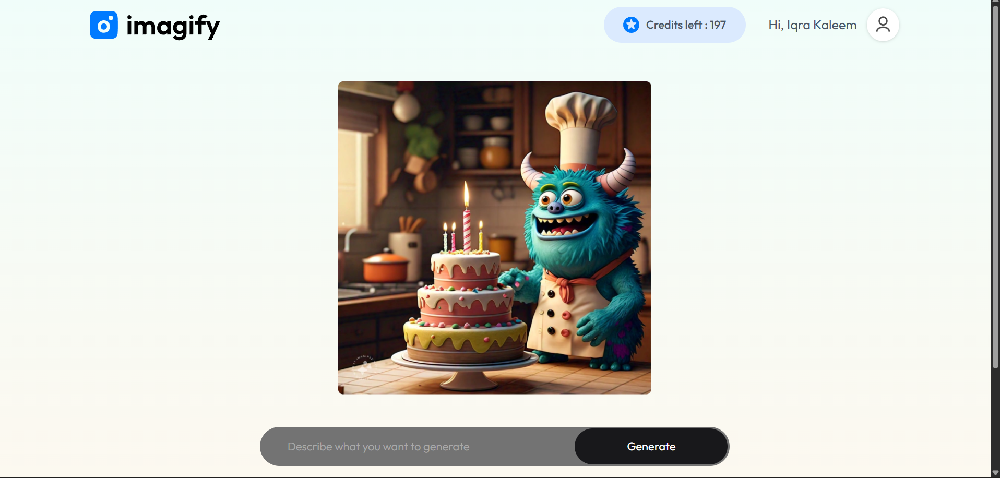

# Imagify

> A full‑stack MERN app to generate, manage, and share AI‑generated images with a credit‑based billing system.

---

## ✨ Features

- **AI Image Generation**: Create images from text prompts.
- **User Accounts & JWT Auth**: Sign up, login, and protected routes.
- **Credit System**: Each generation consumes credits; buy more via payments.
- **Payments (Razorpay)**: Purchase credit packs securely.
- **Image Gallery**: View, download, and manage your creations.
- **Responsive UI**: Modern, mobile‑friendly React frontend.

> Tech: **MongoDB**, **Express.js**, **React**, **Node.js**, JWT, Clipdrop API, Razorpay.

---

## UI

### Home Page

### Image Generation

### Description

### Buy Credtis

